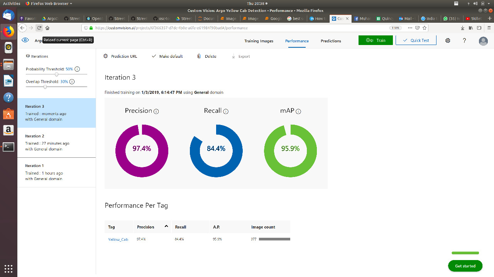

This project was developed within three weeks by NYU CUSP students.

## Week 1
Junjie worked on customvision model.
Urwa worked to import images from google drive path
We then downloaded around 9000 images in New York from Google Street View API.
And we selected the images with yellow taxis (around 60 images) and created a CustomVision Detection project:

Source Images: https://drive.google.com/drive/folders/1-lAv1a88I2xa7sIM1EEWjWJD85ZX2yEP
Code: See [here](https://github.com/Streets-Data-Collaborative/groundwork-detection/blob/ca46f5d7589762a750296e8367a1277ed0aabeeb/Signage/test/test_googleStreetViewEtl.py) for the main method that ran the first iteration of ETL that generated above images

## Week 2
We imported 9000 additional images from Manhattan only.
This yielded the following results:

## Week 3

We finnaly created a script with both ETL with custom-vision model.

The custom-vision model was pre-trained during weeks 1 and 2.

Scripts were developed to upload images from Google-Street-View and Open-Street-Camera and uploaded them to the Custom-Vision pre-trained model. Then we mapped and counted the number of taxis in determined locations.
